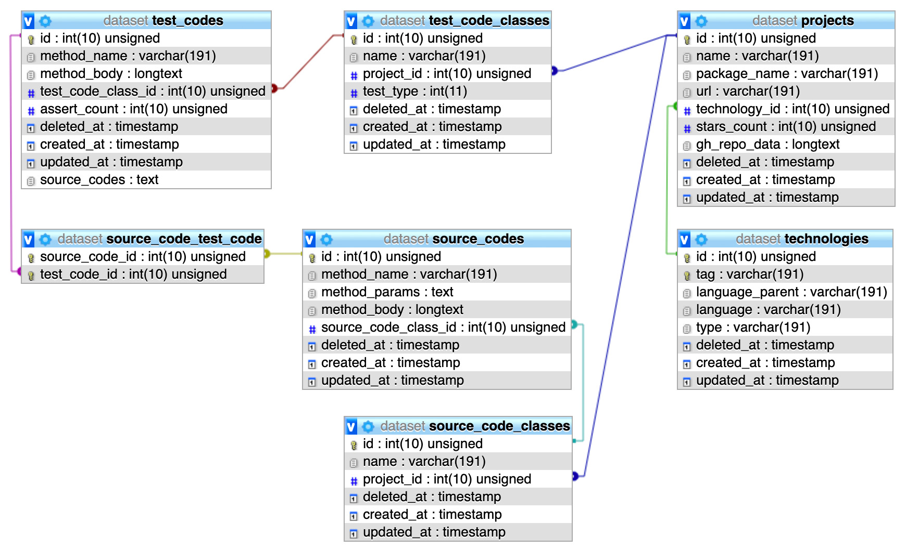

# Android open-source test semantics analysis
This project is part of the scientific paper [Tracing naming semantics in unit tests of popular Github Android projects](https://madeja.github.io/publications/19-slate-android-semantics.pdf) presented at [Symposium on languages, applications and technologies (SLATE 2019)](http://slate-conf.org/2019/). All data were collected on February 2019.

## Data
Project includes [MySQL dump](./dataset.sql) of analyzed data which can be used for other analysis. Database schema is as following:

### Tables

- **projects** - includes 52 very popular open-source projects available on GitHub with data from Feb 2019.
- **technologies** - technologies used for projects (platform /Android/ and languages /Java, Kotlin/).
- **source_code_classes** - Analysed production code classes.
- **source_codes** - Analysed production code methods (name, parameters, body).
- **test_code_classes** - Analysed testing classes.
- **test_codes** - Analysed testing methods (name, parameters, body, number of assertions).

## Acknowledgements
This work was supported by project VEGA No. 1/0762/19: Interactive pattern-driven language development.